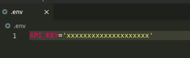

# Weather-web-app
Weather web app using Node.js, Express, and OpenWeatherMap's API

## Getting started
To use this app, you need to register an API Key on the [openweathermap](https://openweathermap.org/api) API service.

You can create an .env file and add your API key there.

