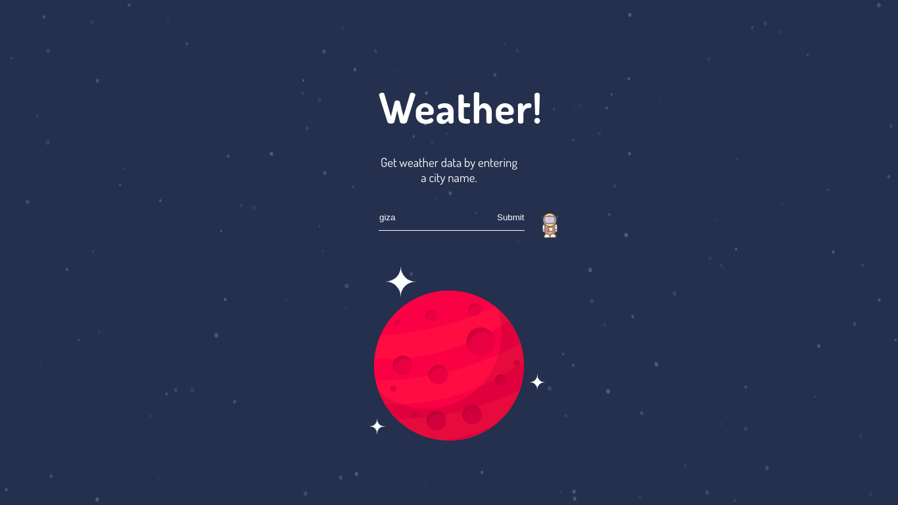
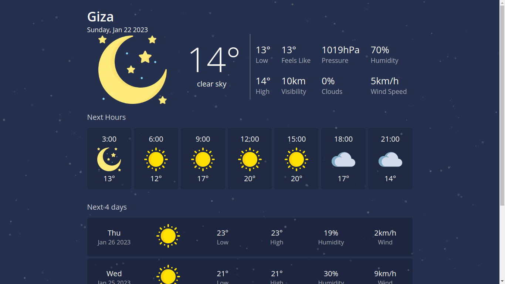
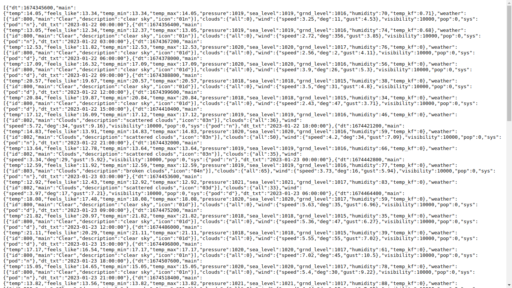
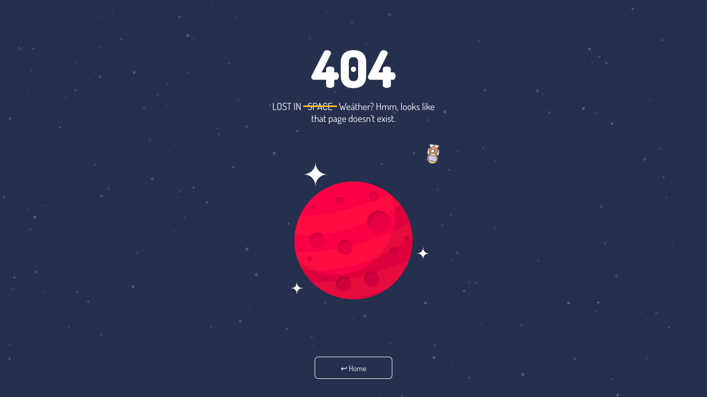

[](https://weather-render-kufc.onrender.com/)

# Weather-web-app
Weather web app using Node.js, Express, and OpenWeatherMap's API

## Getting started
To use this app, you need to register an API Key on the [openweathermap](https://openweathermap.org/api) API service.


You can create an .env file and add your API key there.


## Directory tree
```
web-weather-app
├── assets
│   ├── css
│   │   ├── 404.css
│   │   ├── home.css
│   │   ├── site.css
│   │   └── weather.css
│   ├── icons
│   │   ├── 256
│   │   ├── 64
│   │   ├── astronaut.svg
│   │   ├── fog.png
│   │   └── planet.svg
│   └── js
│       ├── 404.js
│       └── tsparticles.bundle.min.js
├── modules
│   ├── 404.js
│   ├── api.js
│   ├── forecastdata.js
│   ├── home.js
│   └── weather.js
├── Package.json
├── src
│   └── server.js
├── templates
│   ├── partials
│   └── views
│       ├── 404.hbs
│       ├── home.hbs
│       └── weather.hbs
└── utils
    ├── capitalize.js
    ├── logger.js
    ├── mphtokmh.js
    ├── next_weather.js
    ├── now_weather.js
    └── today_weather.js

12 directories, 63 files
```

## Screenshots




